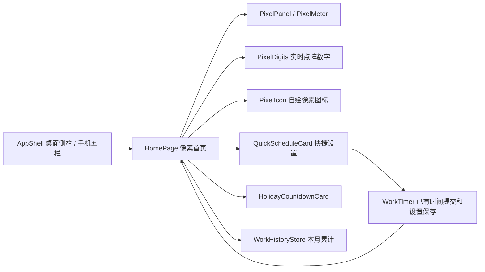
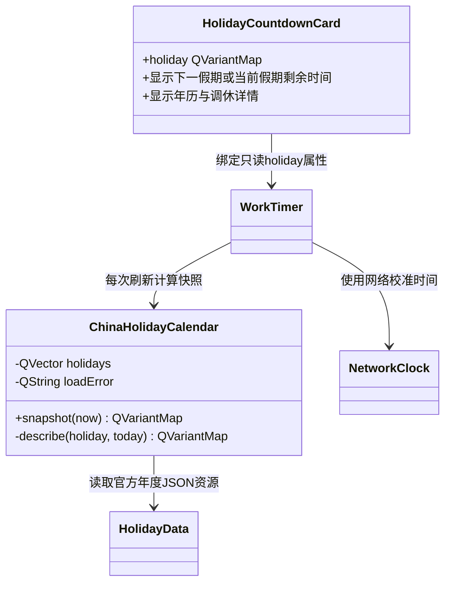
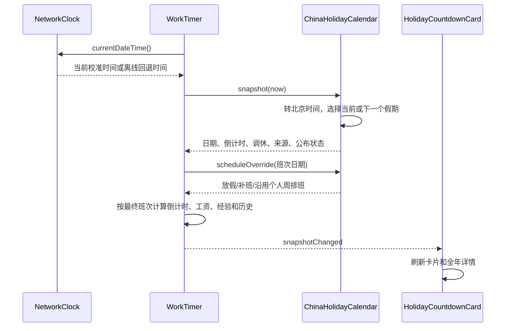
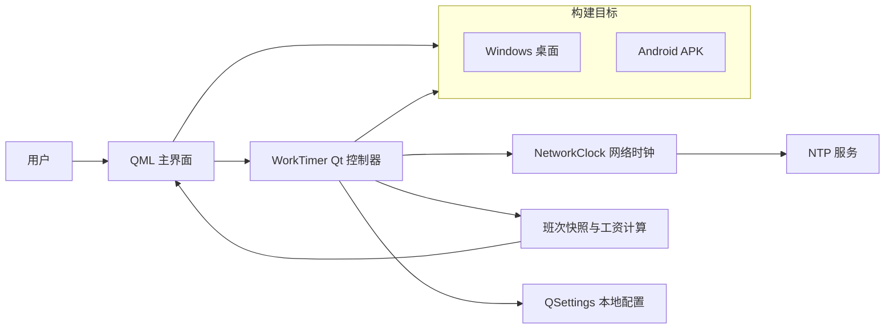
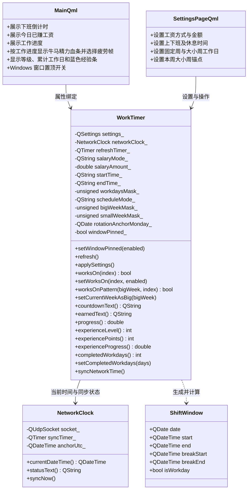
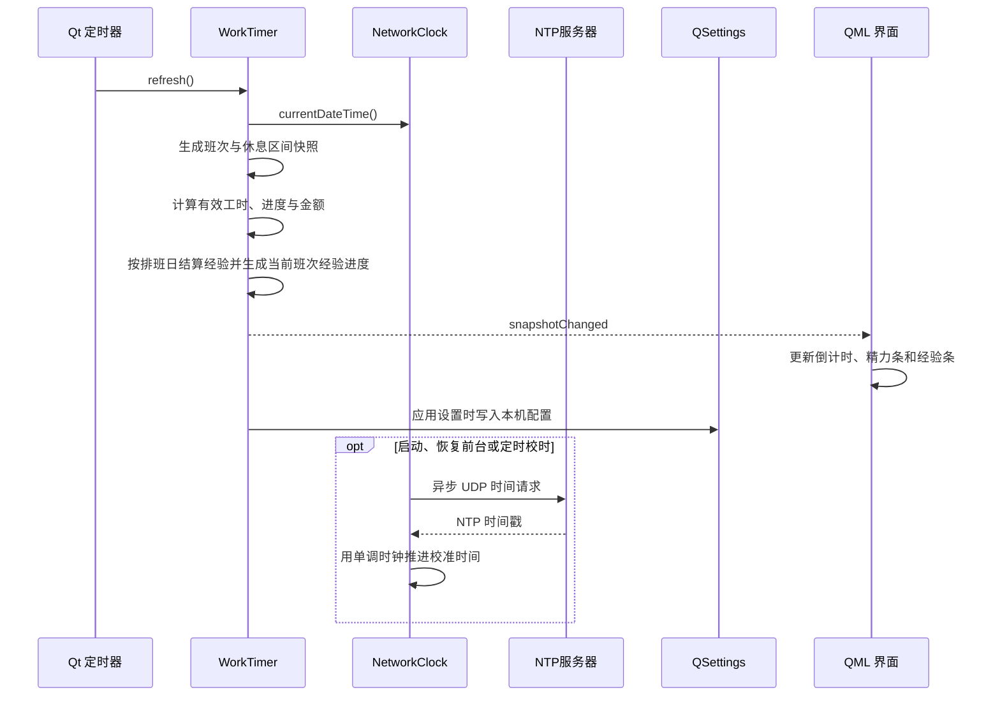
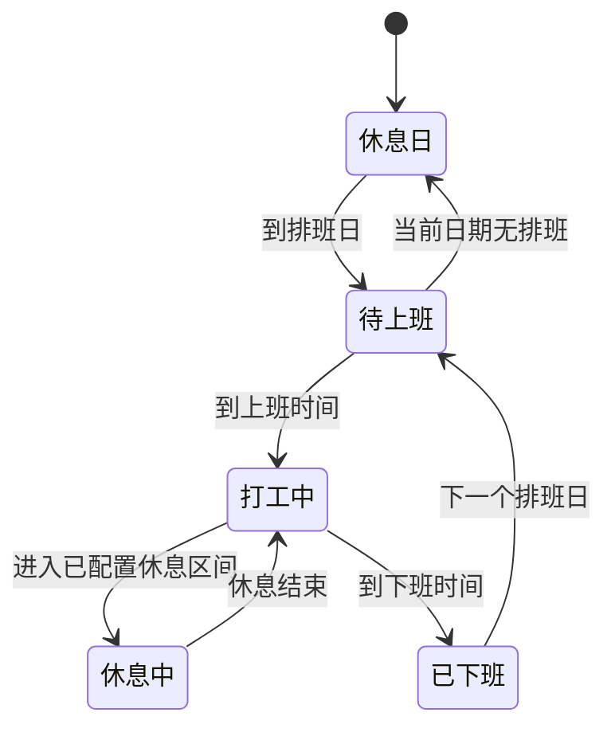
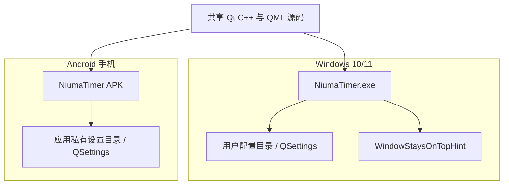

# UML 设计

## 产品图视觉组件（2026-10-08）

## 中国法定节假日模块（2026-10-08）

下列旧版总体图记录首版入口；当前页面已拆为 AppShell 与独立任务、统计、工资、排班、成就、外观、关于页，历史/任务/外观由 WorkHistoryStore 管理；原 SettingsPage 已被独立工资和排班页替换。

## 组件图

## 类图

## 刷新时序图

## 工作状态机

## 部署图

